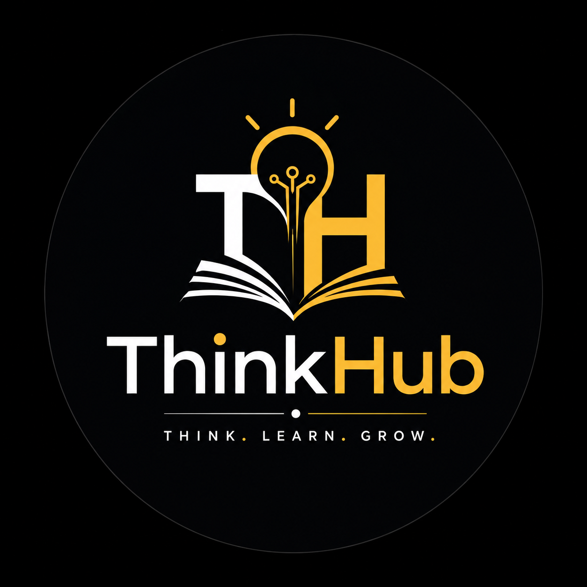
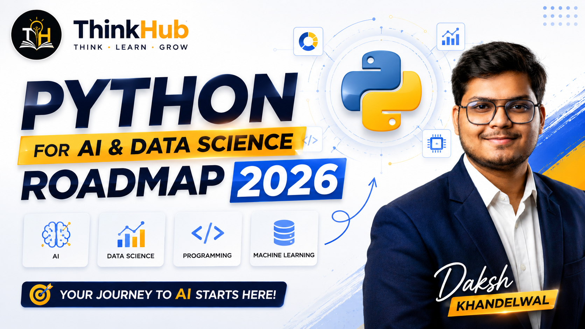
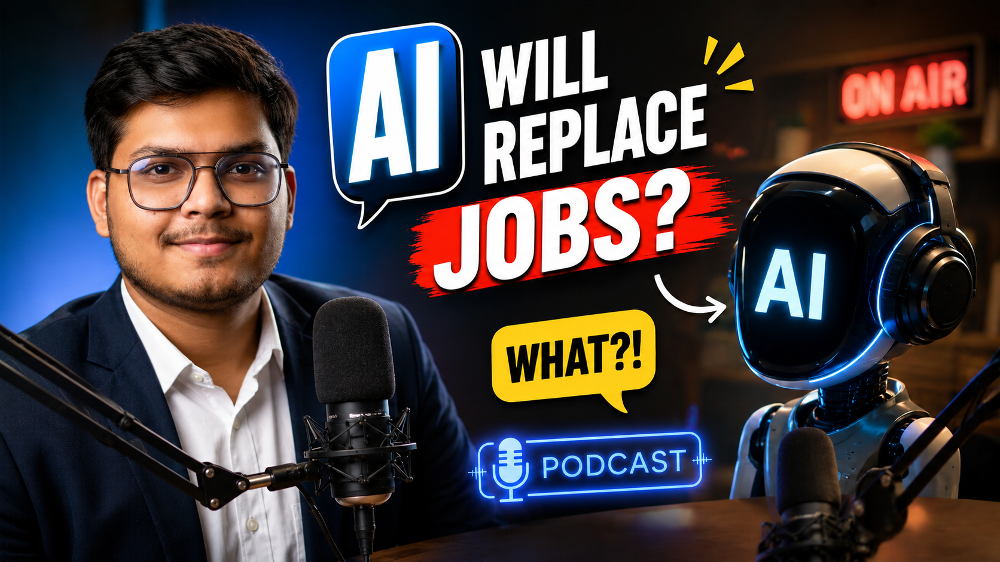
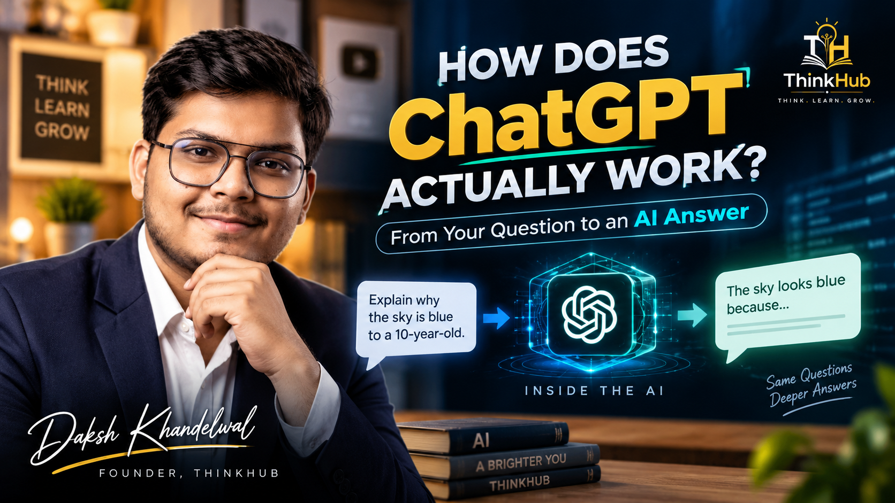

<p align="center">
  
</p>

<h1 align="center">
  <a href="https://www.youtube.com/@ThinkHubbydaksh">
    ThinkHub
  </a>
</h1>

<p align="center">
  <strong>Weekly Ideas. Practical Knowledge. Deeper Learning.</strong>
</p>

<p align="center">
  <a href="https://www.youtube.com/@ThinkHubbydaksh">
    
  </a>
  
  
</p>

<p align="center">
  <i>Think. Learn. Grow.</i>
</p>

---

## 📺 About ThinkHub Weekly

**ThinkHub Weekly** is the weekly educational video series from **ThinkHub**, created to explore interesting ideas, practical skills, career paths, technology, artificial intelligence, programming, data science, and other topics that can help students and learners grow.

Unlike the daily **Beyond The Headlines** series, ThinkHub Weekly focuses on **deeper, topic-based videos** designed to explain concepts, roadmaps, opportunities, tools, and important questions in a simple and practical way.

The series officially started on **1st August 2026** and continues with approximately **one new video every week**.

> 🎯 **The goal is simple:** Take an interesting topic, break it down clearly, and make it useful for someone who wants to learn.

---

## 🧠 What You'll Find Here

This repository serves as the public archive for the ThinkHub Weekly journey.

Topics may include:

|           📚 Category          | 🔎 What We Explore                                          |
| :----------------------------: | :---------------------------------------------------------- |
| 🤖 **Artificial Intelligence** | AI concepts, roadmaps, tools, careers and future trends     |
|       📊 **Data Science**      | Learning paths, skills, tools and practical guidance        |
|       🐍 **Programming**       | Python, programming fundamentals and development skills     |
|        💻 **Technology**       | Modern technologies, tools and important technical concepts |
|  🚀 **Career & Opportunities** | Career roadmaps, skills, jobs and opportunities             |
|    🛠️ **Developer Skills**    | Git, GitHub, VS Code, portfolios and development workflows  |
|     🎓 **Student Learning**    | Resources, strategies and guidance for students             |
|     🌍 **Future & Trends**     | Emerging technologies and changing career landscapes        |

---

# 🎬 Episodes Archive

<p align="center">
  <i>Every week. One new topic. One more thing to learn.</i>
</p>

> **Note:** Thumbnails and YouTube links will be updated as new weekly videos are published.

---

### 📅 August 2026

| 🖼️ Thumbnail | 📅 Date | 🎯 Topic / Video | 📑 Slides | ▶️ Watch |
| :---: | :---: | :--- | :---: | :---: |
|  | **01 Aug 2026** | **Artificial Intelligence Roadmap 2026 — Everything Beginners Should Know** | [📑 View Slides](https://drive.google.com/file/d/1F8m_rAwk5WlQgkWxUueeB_FiRs-RGkeL/view?usp=drive_link) | [▶️ Watch Video](https://youtu.be/cmrfHjmU23M?si=ghAp0tHD3pQfubpJ) |
|  | **08 Aug 2026** | **Python for AI & Data Science Roadmap 2026 — Everything You Need Before Machine Learning** | [📑 View Slides](https://drive.google.com/file/d/1dujPVkD3n2nBkHxnguh4lHs88SYcxsNX/view?usp=drive_link) | [▶️ Watch Video](https://youtu.be/mxz0sZN3rSo?si=jejNnxKzueNTB-_v) |
|  | **15 Aug 2026** | **AI Podcast — Will AI Replace Your Job by 2030? The Truth About the Future of Work** | — | [▶️ Watch Video](https://youtu.be/Wa1Y1scH6_o?si=X2WmTAS0YIFFerwy) |
|  | **22 Aug 2026** | **AI Careers Abroad — The Complete Roadmap** | [📑 View Slides](https://drive.google.com/file/d/1OSDKfHAGIRhJXUZmRRrJ73zvFMUMsAfK/view?usp=drive_link) | [▶️ Watch Video](https://youtu.be/XG3y5YML2uE?si=xoMkNct7WzZpgFji) |
|  | **29 Aug 2026** | **Git & GitHub Complete Guide for Students — Learn Git, GitHub & VS Code and Build Your Portfolio** | [📑 View Slides](https://drive.google.com/file/d/1zc3h3_zGNi3qQ9FgDol3ZRkdSozWdBYJ/view?usp=drive_link) | [▶️ Watch Video](https://youtu.be/FpBkD7Lc0CM?si=yknfEMWCq86wcYnj) |

---

### 📅 September 2026

| 🖼️ Thumbnail | 📅 Date | 🎯 Topic / Video | 📑 Slides | ▶️ Watch |
| :---: | :---: | :--- | :---: | :---: |
|  | **05 Sep 2026** | **Coming Soon** | [📑 View Slides](DRIVE_LINK_06) | [▶️ Watch](YOUTUBE_LINK_06) |
|  | **12 Sep 2026** | **Coming Soon** | [📑 View Slides](DRIVE_LINK_07) | [▶️ Watch](YOUTUBE_LINK_07) |
|  | **19 Sep 2026** | **Coming Soon** | [📑 View Slides](DRIVE_LINK_08) | [▶️ Watch](YOUTUBE_LINK_08) |
|  | **26 Sep 2026** | **Coming Soon** | [📑 View Slides](DRIVE_LINK_09) | [▶️ Watch](YOUTUBE_LINK_09) |

---

## 📊 Series Snapshot

<p align="center">

|        📌        | Details                                             |
| :--------------: | :-------------------------------------------------- |
|   🎥 **Series**  | ThinkHub Weekly                                     |
|  📅 **Started**  | 1st August 2026                                     |
| 📆 **Frequency** | Weekly                                |
|   🎯 **Focus**   | Education • Technology • AI • Careers • Programming |
|  📺 **Platform** | YouTube                                             |
|   🧠 **Format**  | Educational & Explainer Videos                      |
|  👤 **Creator**  | Daksh Khandelwal                                    |
|  🏠 **Channel**  | ThinkHub                                            |

</p>

---

# 🗂️ Repository Structure

```text
thinkhub-weekly/
│
├── README.md
├── LICENSE
│
├── thumbnails/
│   ├── 01.png
│   ├── 02.png
│   ├── 03.png
│   ├── 04.png
│   ├── 05.png
│   ├── 06.png
│   └── ...
│
├── slide_deck/
|
└── assets/
    ├── thinkhub-banner.png
    ├── thinkhub-logo.png
    ├── thinkhub-watermark.png
    ├── thinkhub-intro.mp4
    └── thinkhub-thank-you.mp4
```

---

# 🖼️ Thumbnail Archive

Each weekly episode has its own thumbnail stored inside the `thumbnails/` directory.

```text
thumbnails/
│
├── 01.png    → Week 01
├── 02.png    → Week 02
├── 03.png    → Week 03
├── 04.png    → Week 04
├── 05.png    → Week 05
└── ...
```

This keeps the repository organized and makes it easy to maintain the archive as the series grows.

---

# 🔗 ThinkHub

<p align="center">
  <a href="https://www.youtube.com/@ThinkHubbydaksh">
    
  </a>
</p>

<p align="center">
  <strong>ThinkHub</strong> is a learning-focused YouTube channel sharing educational content around technology, artificial intelligence, data science, programming, careers, current affairs, and practical student knowledge.
</p>

---

# 📺 ThinkHub Content

ThinkHub currently includes multiple content formats:

### 📰 Beyond The Headlines

A daily news and analysis series covering current affairs, technology, AI, geopolitics, business, science and the deeper perspective behind important headlines.

**Daily. News. Perspective.**

### 🎓 ThinkHub Weekly

A weekly educational series covering deeper topics, roadmaps, tutorials, career guidance, technology, AI, programming and other useful ideas.

**Weekly. Knowledge. Growth.**

---

# 🌱 The Philosophy

<p align="center">
  <h3 align="center">Think. Learn. Grow.</h3>
</p>

ThinkHub is built around three simple ideas:

**💭 THINK**
Question things. Explore ideas. Look beyond the obvious.

**📚 LEARN**
Understand concepts. Build skills. Keep improving.

**🌱 GROW**
Apply what you learn. Build. Experiment. Move forward.

> **Learning never stops — and neither should curiosity.**

---

# 🛠️ How This Repository Is Maintained

This repository is updated whenever a new ThinkHub Weekly episode is published.

For every new episode:

```text
1. 🎬 Publish the video on YouTube
        ↓
2. 🖼️ Add the episode thumbnail
        ↓
3. 📝 Add the episode details
        ↓
4. 🔗 Add the YouTube link
        ↓
5. 🚀 Push the update to GitHub
```

The goal is to maintain a **complete, organized and publicly accessible archive** of the ThinkHub Weekly journey.

---

# 📌 Why This Repository?

This repository is more than a collection of YouTube links.

It is a **public record of the ThinkHub Weekly learning journey** — documenting the topics explored, the videos created, and the knowledge shared over time.

From the first episode to the hundredth and beyond, this archive will grow with the channel.

---

# 📜 License

This repository is maintained by **Daksh Khandelwal / ThinkHub**.

The content, branding, thumbnails, logos, video materials and original creative work contained in this repository are the property of their respective creator/owner unless otherwise stated.

Please do not reproduce, redistribute or commercially use the original content without appropriate permission.

---

<p align="center">
  
</p>

<h3 align="center">
  THINKHUB
</h3>

<p align="center">
  <strong>Think. Learn. Grow.</strong>
</p>

<p align="center">
  <i>Ideas today. Knowledge for tomorrow.</i>
</p>

---

<p align="center">
  © 2026 <strong>Daksh Khandelwal / ThinkHub</strong>
</p>

<p align="center">
  <a href="https://www.youtube.com/@ThinkHubbydaksh">YouTube</a>
  •
  <a href="https://github.com/dk-khandelwal06">GitHub</a>
</p>

<p align="center">
  ⭐ If you find the project useful, consider following ThinkHub and supporting the journey.
</p>
